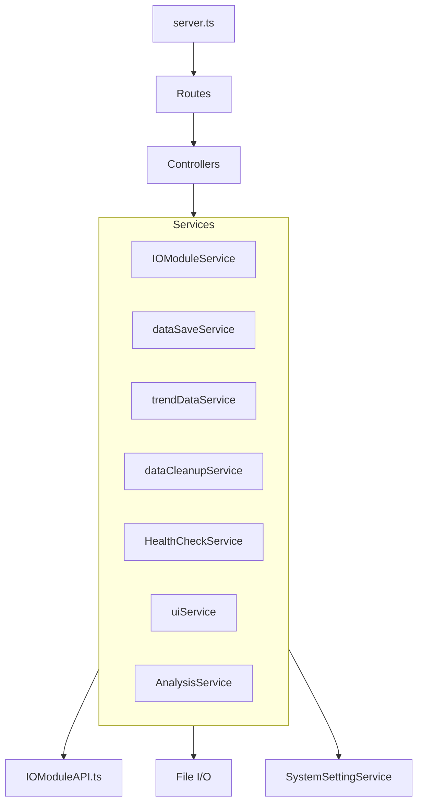
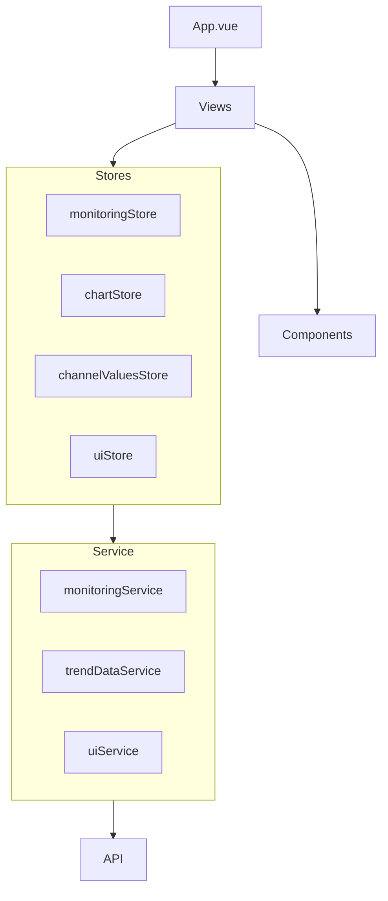

# アーキテクチャ

本ドキュメントでは MonitoringSystemCore のシステムアーキテクチャ、データフロー、各コンポーネントの責務について説明します。

## 目次

- [システム全体構成](#システム全体構成)
- [パッケージ構成](#パッケージ構成)
- [バックエンドアーキテクチャ](#バックエンドアーキテクチャ)
- [フロントエンドアーキテクチャ](#フロントエンドアーキテクチャ)
- [データフロー](#データフロー)
- [依存関係図](#依存関係図)

---

## システム全体構成

```
┌──────────────────────────────────────────────────────────────────┐
│                          クライアント                             │
│                    (ブラウザ / Vue.js SPA)                        │
└──────────────────────┬───────────────────────────────────────────┘
                       │
        ┌──────────────┴──────────────┐
        │ HTTP (REST API)             │ WebSocket
        │ ポート: 2478                │ ポート: 2479
        ▼                             ▼
┌───────────────────────────────────────────────────────────────────┐
│                     バックエンドサーバー                           │
│                        (Express)                                  │
├───────────────────────────────────────────────────────────────────┤
│  Routes → Controllers → Services → API/File I/O                  │
└───────────────────────────────────────────────────────────────────┘
        │                             │
        │ ファイルI/O                 │ HTTP
        ▼                             ▼
┌─────────────────────┐    ┌─────────────────────────┐
│  ローカルストレージ   │    │ ハードウェア制御API      │
│  (CSV / JSON)       │    │ (ポート: 8000)          │
└─────────────────────┘    └─────────────────────────┘
```

---

## パッケージ構成

本システムは pnpm モノレポ構成で以下の3パッケージから構成されています。

| パッケージ | 名前空間 | 役割 |
|-----------|---------|------|
| `apps/backend` | `@monitoring/backend` | REST API・WebSocket サーバー |
| `apps/frontend` | `@monitoring/frontend` | Vue.js SPA クライアント |
| `shared` | `@monitoring/shared` | 共有型定義・ユーティリティ |

### 依存関係

```
@monitoring/shared
       ▲
       │ (型定義を参照)
       │
┌──────┴──────┐
│             │
@monitoring/  @monitoring/
backend       frontend
```

---

## バックエンドアーキテクチャ

### レイヤー構成

```
┌─────────────────────────────────────────────────────────────┐
│                         Routes                              │
│  URLパスとコントローラーのマッピング                          │
└─────────────────────────┬───────────────────────────────────┘
                          ▼
┌─────────────────────────────────────────────────────────────┐
│                      Controllers                            │
│  リクエスト/レスポンス処理、バリデーション                     │
└─────────────────────────┬───────────────────────────────────┘
                          ▼
┌─────────────────────────────────────────────────────────────┐
│                       Services                              │
│  ビジネスロジック、データ操作                                 │
└─────────────────────────┬───────────────────────────────────┘
                          ▼
┌────────────────────┐    ┌────────────────────┐
│   External API     │    │   File I/O         │
│ (IOModuleAPI.ts)   │    │ (dataSaveService)  │
└────────────────────┘    └────────────────────┘
```

### 主要サービス一覧

| サービス | ファイル | 責務 |
|---------|---------|------|
| IOModuleService | `IOModuleService.ts` | IOモジュールの状態管理、サンプリング制御 |
| SystemSettingService | `config/SystemSetting.ts` | システム設定の読み込み・保存（シングルトン） |
| dataSaveService | `dataSaveService.ts` | CSVへのデータ保存・読み込み |
| trendDataService | `trendDataService.ts` | トレンドデータの取得・フィルタリング |
| dataCleanupService | `dataCleanupService.ts` | 古いデータの自動削除 |
| HealthCheckService | `healthCheckService.ts` | システムヘルスチェック |
| uiService | `uiService.ts` | UIレイアウトの管理 |
| AnalysisService | `AnalysisService.ts` | データ解析・累積値計算 |
| cumulativeCacheService | `cumulativeCacheService.ts` | 解析結果のキャッシュ管理 |

### 設定ファイル

ローカル設定は `apps/backend/LocalData/` に JSON 形式で保存されます。

| ファイル | 内容 |
|---------|------|
| `systemSetting.json` | サンプリング周期、データ保存パス、カテゴリ設定 |
| `ioModuleSetting.json` | IOモジュール・チャンネル定義 |
| `uiLayouts.json` | ダッシュボード・トレンド画面のレイアウト |

---

## フロントエンドアーキテクチャ

### レイヤー構成

```
┌─────────────────────────────────────────────────────────────┐
│                          Views                              │
│  ページコンポーネント (Dashboard, Trend, Configurations)     │
└─────────────────────────┬───────────────────────────────────┘
                          │
         ┌────────────────┼────────────────┐
         ▼                ▼                ▼
┌─────────────────┐ ┌─────────────┐ ┌─────────────────────┐
│   Components    │ │    Store    │ │     Composables     │
│  再利用可能UI    │ │   (Pinia)   │ │  ロジックの再利用    │
└─────────────────┘ └──────┬──────┘ └─────────────────────┘
                          │
                          ▼
         ┌─────────────────────────────────────┐
         │              Service                │
         │  API呼び出し & エラーハンドリング     │
         └─────────────────────┬───────────────┘
                               ▼
         ┌─────────────────────────────────────┐
         │             API Layer               │
         │         (axios ラッパー)             │
         └─────────────────────────────────────┘
```

### 主要ストア一覧

| ストア | ファイル | 責務 |
|-------|---------|------|
| monitoringStore | `monitoringStore.ts` | IOモジュール一覧、サンプリング状態 |
| chartStore | `chartStore.ts` | UIレイアウト、チャート設定 |
| channelValuesStore | `channelValuesStore.ts` | チャンネルの最新値・時系列データ |
| uiStore | `uiStore.ts` | テーマ、管理者モード、カテゴリフィルタ |

### 画面一覧

| パス | 画面 | 説明 |
|-----|------|------|
| `/dashboard` | Dashboard | リアルタイム監視ダッシュボード |
| `/trend` | Trend | トレンドグラフ表示 |
| `/configurations` | Configurations | 各種設定画面 |

---

## データフロー

### 1. 起動時の初期化フロー

```
[サーバー起動]
     │
     ├─→ initializeIOModules()     IOモジュール設定の読み込み
     │
     ├─→ initializeLayouts()       UIレイアウトの読み込み
     │
     ├─→ loadSystemSettingFromDatabase()  システム設定の読み込み
     │
     ├─→ healthService.checkDriveMount()  ドライブマウント確認
     │
     └─→ startDataCleanupScheduler()      古いデータの削除スケジューラ開始
```

### 2. リアルタイムデータ取得フロー

```
[サンプリング開始]
     │
     ▼
┌─────────────────────────────────────────────────────────────────┐
│ IOModuleService.startIOModuleInputSamplingInterval()           │
│                                                                 │
│   setInterval で定期実行:                                       │
│     1. IOModuleAPI から入力値を取得                             │
│     2. 値の正規化・閾値判定                                     │
│     3. CSV にデータ保存 (dataSaveService)                       │
│     4. WebSocket でクライアントへブロードキャスト                │
└─────────────────────────────────────────────────────────────────┘
     │
     ▼ WebSocket
┌─────────────────────────────────────────────────────────────────┐
│ フロントエンド (App.vue)                                        │
│                                                                 │
│   onmessage で受信:                                             │
│     1. channelValuesStore を更新                                │
│     2. 閾値超過時にトースト通知                                  │
└─────────────────────────────────────────────────────────────────┘
```

### 3. トレンドデータ取得フロー

```
[トレンド画面表示]
     │
     ▼
┌─────────────────────────────────────────────────────────────────┐
│ trendDataService.fetchTrendData()                              │
│                                                                 │
│   1. AbortController で既存リクエストをキャンセル                │
│   2. GET /api/trend_data でデータ取得                          │
│   3. 解像度に応じてダウンサンプリング                           │
│   4. キャッシュから読み込み（過去データの場合）                  │
└─────────────────────────────────────────────────────────────────┘
```

### 4. 設定変更フロー

```
[設定変更操作]
     │
     ▼
┌─────────────────────────────────────────────────────────────────┐
│ フロントエンド Service 層                                       │
│   1. handleApiRequest でAPI呼び出し                             │
│   2. バックエンドで JSON 更新                                   │
│   3. 成功時に Pinia ストアを更新                                │
└─────────────────────────────────────────────────────────────────┘
```

---

## 依存関係図

### バックエンド内部依存



### フロントエンド内部依存



---

## 補足: 型定義の共有

`@monitoring/shared` パッケージは以下のエクスポートパスを提供します：

| パス | 内容 |
|-----|------|
| `@monitoring/shared/model` | データモデル型定義 |
| `@monitoring/shared/api` | API リクエスト/レスポンス型 |
| `@monitoring/shared/enum` | 列挙型 |
| `@monitoring/shared/utils` | Result型などのユーティリティ |

共有型を更新した場合は必ず `pnpm --filter @monitoring/shared run build` を実行してください。
